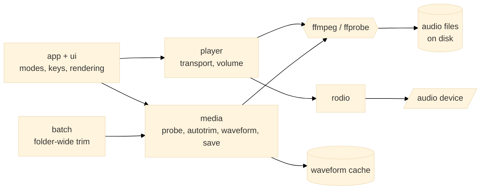
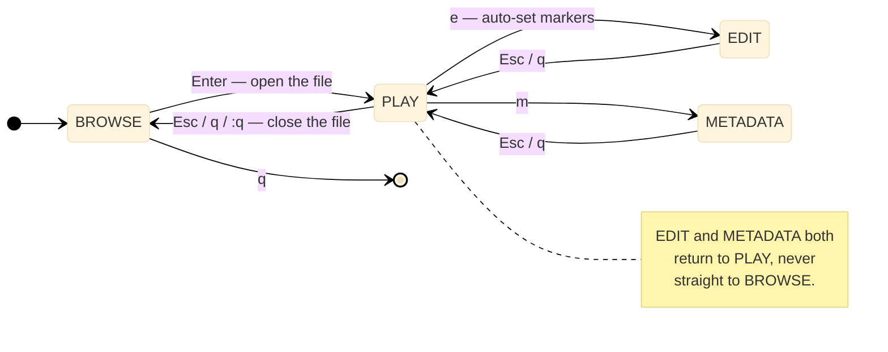

# audioedit

A keyboard-driven terminal editor for browsing, auditioning, trimming and
retagging audio files. It behaves like Vim: distinct modes, `hjkl` navigation,
`/` search, `gg`/`G`, `Esc` to leave a mode, and a `:` command line.

```
browse files → select file → play / inspect → edit trim markers → save in place
```

---

## Architecture

audioedit owns no codec logic. Every decode, probe, trim and mux is delegated to
`ffmpeg`/`ffprobe`, and playback is handed to `rodio` once ffmpeg has decoded the
stream to raw PCM. Waveform buckets are computed in the background and cached on
disk, so the front end never blocks on analysis.



Saving is the one operation that touches your originals, and it is staged so
that a failure at any point is a no-op — see [Saving](#saving).

---

## Prerequisites

| Tool | Version | Notes |
|------|---------|-------|
| Rust toolchain | 1.98.0 | Edition 2021; the devcontainer pins `rust:1.98.0-trixie` |
| `ffmpeg`, `ffprobe` | Any build on `PATH` | All decoding, trimming, muxing and support detection |
| `libasound2-dev`, `pkg-config` | System packages | ALSA headers, required to *build* the output backend |
| `libasound2-plugins` | System package | Only to hear container audio on the host — see [macOS](#macos-apple-silicon) |

The devcontainer installs all of these. Audio output is optional at runtime:
without a device everything except sound still works and the transport says so,
and `--no-audio` skips opening one entirely.

---

## Quick start

```bash
cargo build --release
./target/release/audioedit --help                  # checks the toolchain and ffmpeg
cargo run --release -- --folder ~/recordings       # defaults to the current directory
```

---

## Configuration

`$XDG_CONFIG_HOME/audioedit/config.toml`, or `--config <path>`. A missing file
is not an error, any key may be omitted, and an unknown key is rejected. Every
value has a matching command-line flag, and the flag wins. `config.example.toml`
is an annotated copy of the defaults below.

| Key | Default | Description |
|-----|---------|-------------|
| `playback.small_seek_seconds` | `10` | Seek amount for `←`/`→` and `h`/`l` |
| `playback.large_seek_seconds` | `60` | Seek amount for `Ctrl-←`/`Ctrl-→` and `Ctrl-h`/`Ctrl-l` |
| `playback.volume_step` | `5` | Percentage points per volume key |
| `editing.fine_step_seconds` | `1` | Marker movement for `←`/`→` and `h`/`l` |
| `editing.large_step_seconds` | `10` | Marker movement for `Ctrl-←`/`Ctrl-→` and `Ctrl-h`/`Ctrl-l` |
| `auto_trim.begin_threshold_db` | `-40` | Level below which leading audio counts as silence, in dBFS |
| `auto_trim.end_threshold_db` | `-40` | Level below which trailing audio counts as silence, in dBFS |
| `auto_trim.begin_min_duration` | `3` | How long leading silence must last to be trimmed, in seconds |
| `auto_trim.end_min_duration` | `5` | How long trailing silence must last to be trimmed, in seconds |

The only environment variables read are `AUDIOEDIT_FFMPEG` and
`AUDIOEDIT_FFPROBE`, which point at alternative ffmpeg builds. There is no
`.env` file.

---

## Running Locally

### In the devcontainer (recommended)

Open the repository in VS Code and choose **Reopen in Container**; the image
([`.devcontainer/Dockerfile`](.devcontainer/Dockerfile)) provides everything, so
no host setup is needed. Run the binary from the integrated terminal — there are
no VS Code tasks or launch configurations. See the
[dev container specification](https://aka.ms/devcontainer.json) and the
[non-root user notes](https://aka.ms/vscode-remote/containers/non-root), which
cover how the container user is derived from your `USER`,
`DEV_CONTAINER_USER_ID` and `DEV_CONTAINER_GROUP_ID`.

### macOS (Apple Silicon)

The devcontainer runs in Docker Desktop's Linux VM, which has no sound hardware:
`/dev/snd` does not exist, so `--device /dev/snd` passthrough has nothing to
forward. Two ways around it.

**Build natively** — nothing in the crate is Linux-specific, and rodio uses
CoreAudio on macOS, so this gets real audio with no added latency. Use it
whenever you are judging trim points by ear.

```bash
brew install ffmpeg
cargo build --release --target aarch64-apple-darwin
```

That is the native triple, so plain `cargo build --release` builds the same
binary — but name the target anyway. `target/` is bind-mounted into the
devcontainer, so host and container builds otherwise collide in
`target/release/` and force a full rebuild on every switch. A separate
`CARGO_TARGET_DIR` works too. Cross-compiling to macOS *from* the devcontainer
is not supported: linking needs Apple's SDK, where the CoreAudio and
AudioToolbox frameworks live.

**Or play the container's audio on the host.** The image carries the
ALSA→PulseAudio bridge and points ALSA's default device at `$PULSE_SERVER`
(`tcp:host.docker.internal:4713`, set in
[`devcontainer.json`](.devcontainer/devcontainer.json)), so only the host side
is left:

```bash
brew install pulseaudio
pulseaudio --exit-idle-time=-1 --daemonize \
  --load="module-native-protocol-tcp listen=0.0.0.0 auth-ip-acl=127.0.0.1;172.17.0.0/16"
```

Then `pactl info` in the container should report the host server. `172.17.0.0/16`
is Docker's default bridge subnet; check yours with `ip route` if the connection
is refused. Note that this adds roughly 100–300 ms of latency, and that
`listen=0.0.0.0` exposes the server to your local network — the PulseAudio
protocol permits recording as well as playback, so keep the macOS firewall on
and the ACL no wider than the bridge subnet.

### Batch mode

Apply the automatic trim policy to a whole folder, without the TUI. Each file is
processed independently: a failure on one is recorded and the run continues.

```bash
audioedit --folder ~/recordings --apply-defaults          # asks first
audioedit --folder ~/recordings --apply-defaults --yes    # unattended
audioedit --folder ~/recordings --dry-run                 # report only, writes nothing
```

A dry run performs the same silence detection as a real run and prints what each
file *would* become.

### Command-line reference

| Flag | Description |
|------|-------------|
| `--folder <PATH>` | Folder to work in (defaults to the current directory) |
| `--config <PATH>` | Configuration file to read instead of the default location |
| `--apply-defaults` | Apply the automatic trim policy to every supported file in the folder |
| `--dry-run`, `-n` | Report what `--apply-defaults` would do without modifying any file |
| `--yes`, `-y` | Skip the confirmation prompt before a folder-wide run |
| `--no-audio` | Do not open an audio device (browsing and editing still work) |

`audioedit --help` lists the full set, including a per-run override for every
configuration value.

---

## Modes



The mode is always shown in the top-left. A file with unsaved changes is marked
`[+]`, and leaving it asks before discarding. `q` behaves like `Esc` in every
mode: it steps back one level rather than quitting, except in BROWSE where it
exits.

### BROWSE

| Key | Action |
| --- | --- |
| `j` `k` `↓` `↑` | next / previous file |
| `gg` `G` | first / last file |
| `Ctrl-d` `Ctrl-u` | page down / up |
| `/` `n` `N` | search, next match, previous match |
| `Enter` | open in PLAY mode |
| `r` | rescan the folder |
| `q` | quit |

Files are listed by probing them, not by trusting extensions, so anything
ffprobe recognises as audio appears and nothing else does.

### PLAY

| Key | Action |
| --- | --- |
| `space` | play / pause |
| `←` `→` `h` `l` | seek by the small step (default 10 s) |
| `Ctrl-←` `Ctrl-→` `Ctrl-h` `Ctrl-l` | seek by the large step (default 60 s) |
| `↑` `↓` `k` `j` | volume up / down |
| `e` / `m` | EDIT / METADATA mode |
| `Esc` | back to BROWSE |

The waveform covers the whole file, scales to the terminal width and shows the
playback cursor in real time.

### EDIT

Two markers define what is *kept*: everything between `beginning` and `ending`.
On entering EDIT they are set automatically, moving past leading silence and
stopping before trailing silence.

| Key | Action |
| --- | --- |
| `←` `→` `h` `l` | move the active marker by the fine step (default 1 s) |
| `Ctrl-←` `Ctrl-→` `Ctrl-h` `Ctrl-l` | move it by the large step (default 10 s) |
| `Tab` | switch between the beginning and ending marker |
| `b` / `e` | set the beginning / ending marker at the playhead |
| `B` / `E` / `i` | type a position |
| `a` | recalculate the automatic markers |
| `r` | reset to the whole file |
| `p` | play from the active marker |

Positions can be relative to either end, so you never have to work out an
absolute timestamp. For a ten-minute file `:b +10s` is `00:10` and `:e -10s` is
`09:50`, and the expression stays on screen next to the timestamp it resolves to.

```
+10s    10 seconds after the start
-10s    10 seconds before the end
+1m     one minute in
50%     halfway
10:00   an absolute timestamp
```

### METADATA

`j`/`k` move between fields, `Enter` or `i` edits one, `u` reverts it, and `:w`
saves. Edited fields are highlighted until saved.

### Commands

```
:w                        save in place
:q                        leave the file (or quit)
:q!                       leave, discarding changes
:wq                       save and leave
:b <pos>  :e <pos>        set a marker, e.g. :b +10s
:auto                     recalculate automatic markers
:reset                    reset markers to the whole file
:apply-defaults           trim every file in the folder
:apply-defaults --dry-run report what would change, writing nothing
:help                     key reference
```

---

## Saving

Saving is in-place, and the original is only ever replaced by an atomic rename
over a file that has already been produced and checked:

```
source file → temporary output → media validation → metadata validation → atomic replacement
```

If any step fails the original is left byte-for-byte untouched, the temporary
file is removed, and the error dialog says so with the ffmpeg diagnostics behind
`[Enter] details`.

Lossless stream copy is preferred; when copying cannot produce a valid file the
audio is re-encoded keeping the source codec and bitrate, and the summary always
states which was used. (FLAC is the common case: ffmpeg copies the source
`STREAMINFO`, so a stream-copied trim would declare the wrong length — audioedit
rejects that and re-encodes, which is still lossless.) Metadata is compared field
by field against the finished file, so nothing is claimed as preserved unless it
is actually in the output.

---

## Testing

```bash
cargo test                      # unit tests plus integration tests against real audio
cargo test --test saving        # end-to-end save/trim/metadata tests only
cargo clippy --all-targets
cargo fmt
```

The integration tests in `tests/` (`probing.rs`, `autotrim.rs`, `saving.rs`,
`waveform.rs`, `batch.rs`, `cli.rs`, sharing fixtures from `tests/common/`)
build fixtures with a real `ffmpeg` (so it must be on `PATH`) and assert the
guarantees that matter: originals survive failed saves, no-ops do not rewrite
files, dry runs write nothing, and metadata claims match what is on disk.

---

## Project Structure

```
audio-tui-editor/
├── src/
│   ├── main.rs           # entry point: batch run or TUI event loop
│   ├── lib.rs            # crate root, re-exports the modules below
│   ├── cli.rs            # clap definitions and config overrides
│   ├── config.rs         # config file schema, defaults and validation
│   ├── text.rs           # shared string helpers (e.g. ellipsis truncation)
│   ├── timespec.rs       # parsing of +10s / -1m / 50% / 10:00 positions
│   ├── app/              # application state, modes and key handling
│   │   ├── mod.rs        # App struct, mode dispatch, shared test fixtures
│   │   ├── browse.rs     # browse-mode key handling
│   │   ├── play.rs       # play-mode key handling
│   │   ├── edit.rs       # edit-mode key handling
│   │   ├── metadata.rs   # metadata-mode key handling
│   │   ├── overlay.rs    # overlay/help state and key handling
│   │   ├── prompt.rs     # `:` command prompt state and key handling
│   │   ├── nav.rs        # navigation between songs and markers
│   │   ├── command.rs    # `:` command parsing
│   │   ├── session.rs    # the currently open file
│   │   ├── save.rs       # background save/refresh pipeline
│   │   └── batch_view.rs # background batch pipeline for the TUI
│   ├── ui/               # ratatui rendering, one module per mode
│   │   ├── mod.rs        # render dispatcher, header/footer
│   │   ├── browse.rs     # browse-mode rendering
│   │   ├── play.rs       # play-mode rendering
│   │   ├── edit.rs       # edit-mode rendering
│   │   ├── metadata.rs   # metadata-mode rendering
│   │   ├── waveform.rs   # waveform rendering, shared by play/edit
│   │   └── overlay.rs    # popups, help and warning text
│   ├── player/           # transport, seeking and volume (rodio)
│   │   ├── mod.rs        # AudioOutput / AudioPlayer
│   │   └── decoder.rs    # ffmpeg-backed PCM decoder
│   ├── batch/            # folder-wide trim, including dry runs
│   │   ├── mod.rs        # run modes and the batch pipeline
│   │   └── report.rs     # per-item and summary reporting
│   └── media/            # everything that shells out to ffmpeg/ffprobe
│       ├── mod.rs        # binary resolution (AUDIOEDIT_FFMPEG/FFPROBE)
│       ├── probe.rs      # support detection and metadata reads
│       ├── scan.rs       # folder scanning for probeable media
│       ├── autotrim.rs   # silence detection via ffmpeg silencedetect
│       ├── waveform/     # peak/RMS analysis and the on-disk cache
│       │   ├── mod.rs
│       │   └── cache.rs
│       └── ffmpeg/       # the trim and save pipeline
│           ├── mod.rs      # save orchestration and atomicity
│           ├── command.rs  # ffmpeg command building and encoder selection
│           └── metadata.rs # metadata comparison and reporting
├── tests/                # end-to-end tests against real audio
│   ├── common/mod.rs     # shared fixtures (Workspace, probe_ok, ...)
│   ├── probing.rs
│   ├── autotrim.rs
│   ├── saving.rs
│   ├── waveform.rs
│   ├── batch.rs
│   └── cli.rs
├── config.example.toml   # annotated copy of every default
├── design.md             # the design the source comments cite (design §N)
└── .devcontainer/        # pinned Rust toolchain, ffmpeg, ALSA headers, Pulse bridge
```

The crate is split as a library plus a thin binary so the media pipeline can be
exercised directly by the integration tests.

---

## Troubleshooting

**`ffmpeg` or `ffprobe` not found** — both must be on `PATH`, or pointed at with
`AUDIOEDIT_FFMPEG` / `AUDIOEDIT_FFPROBE`.

**The build fails looking for ALSA headers** — install `libasound2-dev` and
`pkg-config`. They are build-time requirements even if you only run
`--no-audio`.

**No sound, and the transport says there is no device** — expected wherever no
device is available, such as over SSH. Everything except sound still works.

**No sound in the devcontainer on macOS** — audio has to reach a PulseAudio
server on the host over TCP; see [macOS](#macos-apple-silicon). Check in order:

```bash
# In the container
echo $PULSE_SERVER                      # tcp:host.docker.internal:4713
getent hosts host.docker.internal       # must resolve
pactl info                              # must reach the host server

# On the Mac
pactl list modules short | grep tcp     # module-native-protocol-tcp must be loaded
lsof -nP -iTCP:4713 -sTCP:LISTEN        # must listen on *:4713, not 127.0.0.1:4713
```

A refused connection with the daemon running usually means `--load=` was ignored
because a daemon was already up (`pulseaudio --kill` first), or that it bound
only to loopback. Changes to `PULSE_SERVER` or `runArgs` need a container
rebuild.

**A file I expect to see is missing from BROWSE** — the listing comes from
ffprobe, not from extensions. If ffprobe reports no audio stream, the file is
not shown.

**The waveform seems stale** — analysis is cached under the platform cache
directory in `audioedit/waveform/`, keyed on path, mtime, size and analysis
parameters. Delete that directory to force a re-analysis.

---

[Design document](design.md) — the section numbers cited throughout the source.
