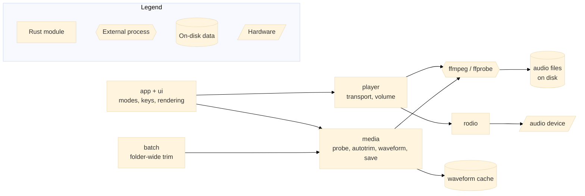

# audioedit

A keyboard-driven terminal editor for browsing, auditioning, trimming and
retagging audio files. It behaves like Vim: distinct modes, `hjkl` navigation,
`/` search, `gg`/`G`, `Esc` to leave a mode, and a `:` command line.

```
browse files → select file → play / inspect → edit trim markers → save in place
```

---

## Architecture

audioedit owns no codec logic. Every decode, probe, trim and mux is delegated
to `ffmpeg`/`ffprobe`, and playback is handed to `rodio` once ffmpeg has
decoded the stream to raw PCM. The terminal front end (`app` + `ui`) never
blocks on analysis: waveform buckets are computed once per file in the
background and cached on disk.



Saving is the one operation that touches the user's originals, and it is
staged so that a failure at any point is a no-op — see [Saving][3].

---

## Prerequisites

| Tool | Version | Notes |
|------|---------|-------|
| Rust toolchain | 1.98.0 | Edition 2021; the devcontainer pins `rust:1.98.0-trixie` |
| `ffmpeg` | Any build on `PATH` | Does all decoding, trimming and muxing |
| `ffprobe` | Any build on `PATH` | Determines which files are supported |
| `libasound2-dev` | System package | ALSA headers, required to *build* the audio output backend |
| `pkg-config` | System package | Locates the ALSA headers at build time |

> Audio output is optional at runtime. Without a device, everything except
> sound still works and the transport says so. Pass `--no-audio` to skip
> opening a device entirely.

The devcontainer installs all of the above; nothing else is required.

---

## Installation

```bash
# Build the release binary
cargo build --release

# Confirm the toolchain and ffmpeg are both wired up
./target/release/audioedit --help
```

There is no `.env` file — the only environment variables audioedit reads are
the two optional binary overrides in [Configuration][5].

---

## Configuration

### Environment variables

| Variable | Required | Default | Description |
|----------|----------|---------|-------------|
| `AUDIOEDIT_FFMPEG` | No | `ffmpeg` | Path to an alternative ffmpeg build |
| `AUDIOEDIT_FFPROBE` | No | `ffprobe` | Path to an alternative ffprobe build |

### Configuration file

`$XDG_CONFIG_HOME/audioedit/config.toml` (or `--config <path>`). A missing file
is not an error — the defaults below apply. Any section or key may be omitted,
but an unknown key is rejected. `config.example.toml` in the repo root contains
this same content, annotated.

```toml
[playback]
small_seek_seconds = 10
large_seek_seconds = 60
volume_step = 5

[editing]
fine_step_seconds = 1
large_step_seconds = 10

[auto_trim]
begin_threshold_db = -40
end_threshold_db = -40
begin_min_duration = 1
end_min_duration = 1
```

| Key | Default | Description |
|-----|---------|-------------|
| `playback.small_seek_seconds` | `10` | Seek amount for `←`/`→` and `h`/`l` |
| `playback.large_seek_seconds` | `60` | Seek amount for `Ctrl-←`/`Ctrl-→` and `Ctrl-h`/`Ctrl-l` |
| `playback.volume_step` | `5` | Percentage points added or removed by each volume key |
| `editing.fine_step_seconds` | `1` | Marker movement for `←`/`→` and `h`/`l` |
| `editing.large_step_seconds` | `10` | Marker movement for `Ctrl-←`/`Ctrl-→` and `Ctrl-h`/`Ctrl-l` |
| `auto_trim.begin_threshold_db` | `-40` | Level below which leading audio counts as silence, in dBFS |
| `auto_trim.end_threshold_db` | `-40` | Level below which trailing audio counts as silence, in dBFS |
| `auto_trim.begin_min_duration` | `1` | How long the leading silence must last to be trimmed, in seconds |
| `auto_trim.end_min_duration` | `1` | How long the trailing silence must last to be trimmed, in seconds |

Every value has a matching command-line flag, and the flag wins.

---

## Running Locally

### In the devcontainer (recommended)

Open the repository in VS Code and choose **Reopen in Container**. The image
([`.devcontainer/Dockerfile`][4]) provides the pinned
Rust toolchain, `rust-analyzer`, `ffmpeg` and the ALSA build headers, so no
host setup is needed. See the [dev container specification][1] for the format,
and the [non-root user notes][2] for how the container user is derived from
your local `USER`, `DEV_CONTAINER_USER_ID` and `DEV_CONTAINER_GROUP_ID`.

There are no VS Code tasks or launch configurations — run the binary from the
integrated terminal.

### Running the editor

```bash
cargo run --release                                # the current directory
cargo run --release -- --folder ~/recordings
```

Configuration values can be overridden per run:

```bash
audioedit \
  --folder ~/recordings \
  --begin-threshold-db -40 \
  --end-threshold-db -40 \
  --begin-min-duration 1 \
  --end-min-duration 1
```

### Batch mode

Apply the automatic trim policy to every supported file in a folder, without
the TUI:

```bash
audioedit --folder ~/recordings --apply-defaults          # asks first
audioedit --folder ~/recordings --apply-defaults --yes    # unattended
audioedit --folder ~/recordings --dry-run                 # report only, writes nothing
```

A dry run performs exactly the same silence detection as a real run and prints
what each file *would* become, without modifying anything. `--dry-run` on its
own implies a folder-wide dry run. Each file is processed independently: a
failure on one is recorded and the run continues.

### Command-line reference

| Flag | Description |
|------|-------------|
| `--folder <PATH>` | Folder to work in (defaults to the current directory) |
| `--config <PATH>` | Configuration file to read instead of the default location |
| `--apply-defaults` | Apply the automatic trim policy to every supported file in the folder |
| `--dry-run`, `-n` | Report what `--apply-defaults` would do without modifying any file |
| `--yes`, `-y` | Skip the confirmation prompt before a folder-wide run |
| `--no-audio` | Do not open an audio device (browsing and editing still work) |

Run `audioedit --help` for the full list, including the per-run overrides for
every configuration value.

---

## Modes

```
BROWSE  Enter → PLAY
PLAY    e → EDIT    m → METADATA    Esc → BROWSE
EDIT    Esc → PLAY
METADATA Esc → PLAY
```

The mode is always shown in the top-left. A file with unsaved changes is
marked `[+]`, and leaving it asks before discarding.

### BROWSE

| Key | Action |
| --- | --- |
| `j` `k` `↓` `↑` | next / previous file |
| `gg` `G` | first / last file |
| `Ctrl-d` `Ctrl-u` | page down / up |
| `/` `n` `N` | search, next match, previous match |
| `Enter` | open in PLAY mode |
| `r` | rescan the folder |
| `q` | quit |

Files are listed by probing them, not by trusting extensions, so anything
ffprobe recognises as audio appears and nothing else does.

### PLAY

| Key | Action |
| --- | --- |
| `space` | play / pause |
| `←` `→` `h` `l` | seek by the small step (default 10 s) |
| `Ctrl-←` `Ctrl-→` `Ctrl-h` `Ctrl-l` | seek by the large step (default 60 s) |
| `↑` `↓` `k` `j` | volume up / down |
| `e` / `m` | EDIT / METADATA mode |
| `Esc` | back to BROWSE |

The waveform covers the whole file, scales to the terminal width and shows the
playback cursor in real time. Analysis runs once per file in the background and
is cached on disk, so playback updates never recompute it.

### EDIT

Two markers define what is *kept*: everything between `beginning` and `ending`.

| Key | Action |
| --- | --- |
| `←` `→` `h` `l` | move the active marker by the fine step (default 1 s) |
| `Ctrl-←` `Ctrl-→` `Ctrl-h` `Ctrl-l` | move it by the large step (default 10 s) |
| `Tab` | switch between the beginning and ending marker |
| `b` / `e` | set the beginning / ending marker at the playhead |
| `B` / `E` / `i` | type a position |
| `a` | recalculate the automatic markers |
| `r` | reset to the whole file |
| `p` | play from the active marker |

Positions can be written relative to either end of the file, so you never have
to work out an absolute timestamp:

```
+10s    10 seconds after the start
-10s    10 seconds before the end
+1m     one minute in
50%     halfway
10:00   an absolute timestamp
```

For a ten-minute file, `:b +10s` is `00:10` and `:e -10s` is `09:50`. The
expression you wrote is kept on screen next to the timestamp it resolves to.

On entering EDIT mode the markers are set automatically: the beginning moves
past any leading silence and the ending stops before any trailing silence,
using the configured thresholds and minimum durations.

### METADATA

`j`/`k` move between fields, `Enter` or `i` edits one, `u` reverts it, and
`:w` saves. Edited fields are highlighted until saved.

### Commands

```
:w                        save in place
:q                        leave the file (or quit)
:q!                       leave, discarding changes
:wq                       save and leave
:b <pos>  :e <pos>        set a marker, e.g. :b +10s
:auto                     recalculate automatic markers
:reset                    reset markers to the whole file
:apply-defaults           trim every file in the folder
:apply-defaults --dry-run report what would change, writing nothing
:help                     key reference
```

---

## Saving

Saving is an in-place operation, and the original is only ever replaced by an
atomic rename over a file that has already been produced and checked:

```
source file → temporary output → media validation → metadata validation → atomic replacement
```

If any step fails the original is left byte-for-byte untouched, the temporary
file is removed, and the error dialog says so with the ffmpeg diagnostics
behind `[Enter] details`.

Lossless stream copy is preferred. When copying cannot produce a valid file the
audio is re-encoded with an explicit policy that keeps the source codec and
bitrate, and the save summary always states which was used. (FLAC is the common
case: ffmpeg copies the source `STREAMINFO`, so a stream-copied trim would
declare the wrong length — audioedit rejects that and re-encodes, which is
still lossless.)

Metadata is compared field by field between the source and the finished file,
and the summary reports exactly what survived. Nothing is claimed as preserved
unless it is actually present in the output.

---

## Testing

```bash
cargo test                      # unit tests plus integration tests against real audio
cargo test --test pipeline      # end-to-end pipeline tests only
cargo clippy --all-targets
cargo fmt
```

The integration tests in `tests/pipeline.rs` build audio fixtures with ffmpeg
and assert the guarantees that matter: originals survive failed saves, no-ops
are reported and do not rewrite files, dry runs write nothing, and metadata
claims match what is on disk. They shell out to a real `ffmpeg`, so the binary
must be on `PATH` for the suite to pass.

---

## Project Structure

```
audio-tui-editor/
├── src/
│   ├── main.rs           # entry point: batch run or TUI event loop
│   ├── lib.rs            # crate root, re-exports the modules below
│   ├── cli.rs            # clap definitions and config overrides
│   ├── config.rs         # config file schema, defaults and validation
│   ├── app.rs            # application state, modes and key handling
│   ├── ui.rs             # ratatui rendering
│   ├── player.rs         # transport, seeking and volume (rodio)
│   ├── batch.rs          # folder-wide trim, including dry runs
│   ├── timespec.rs       # parsing of +10s / -1m / 50% / 10:00 positions
│   └── media/            # everything that shells out to ffmpeg/ffprobe
│       ├── mod.rs        # binary resolution (AUDIOEDIT_FFMPEG/FFPROBE)
│       ├── probe.rs      # support detection and metadata reads
│       ├── autotrim.rs   # silence detection via ffmpeg silencedetect
│       ├── waveform.rs   # peak/RMS analysis and the on-disk cache
│       └── ffmpeg.rs     # the trim and save pipeline
├── tests/pipeline.rs     # end-to-end tests against real audio
├── config.example.toml   # annotated copy of every default
├── design.md             # the design the source comments cite (design §N)
└── .devcontainer/        # pinned Rust toolchain, ffmpeg, ALSA headers
```

The crate is deliberately split as a library plus a thin binary so the media
pipeline can be exercised directly by the integration tests.

---

## Troubleshooting

**`ffmpeg` or `ffprobe` not found**

Both must be on `PATH`. Install them, or point audioedit at a specific build
with `AUDIOEDIT_FFMPEG` and `AUDIOEDIT_FFPROBE`.

**The build fails looking for ALSA headers**

Install `libasound2-dev` and `pkg-config`. These are build-time requirements
of the audio output backend, and are needed even if you only ever run with
`--no-audio`.

**No sound, and the transport says there is no device**

Expected when no audio device is available — for example over SSH or in a
container without one passed through. Browsing, trimming, metadata editing and
saving all still work.

**A file I expect to see is missing from BROWSE**

The listing is built by probing every file with ffprobe rather than by matching
extensions. If ffprobe does not report an audio stream, the file is not shown.

**The waveform seems stale**

Analysis is cached under the platform cache directory in
`audioedit/waveform/`. The cache key includes the file path, modification time,
size and analysis parameters, so an edited file re-analyses automatically.
Delete that directory to force a full re-analysis.

---

## References

- [Dev container specification][1]
- [Dev containers: non-root users][2]
- [Design document][6] — the section numbers cited throughout the source

---

<!-- References -->
[1]: https://aka.ms/devcontainer.json
[2]: https://aka.ms/vscode-remote/containers/non-root
[3]: #saving
[4]: .devcontainer/Dockerfile
[5]: #configuration
[6]: design.md
